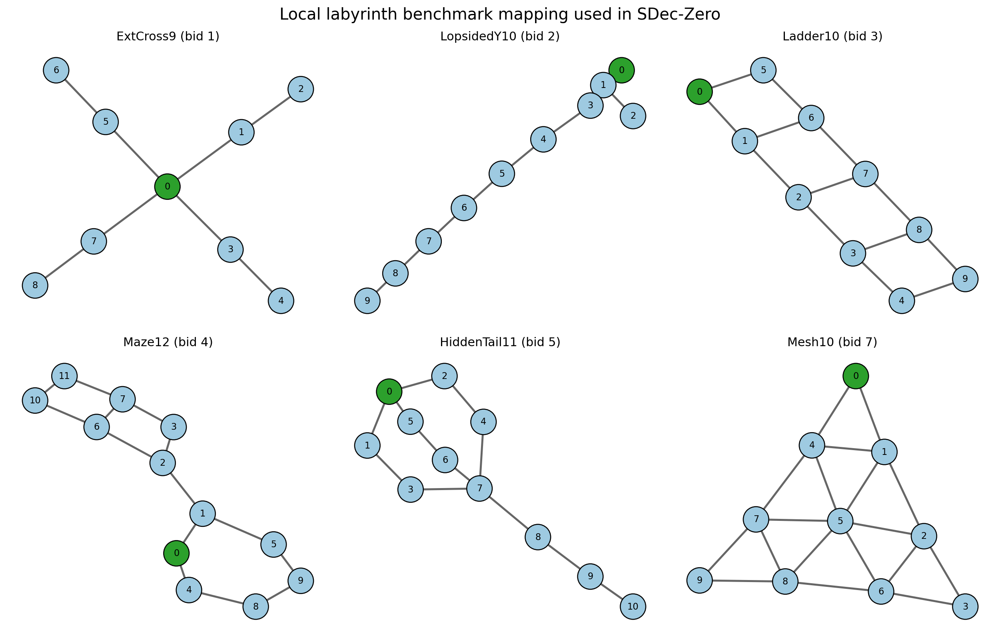
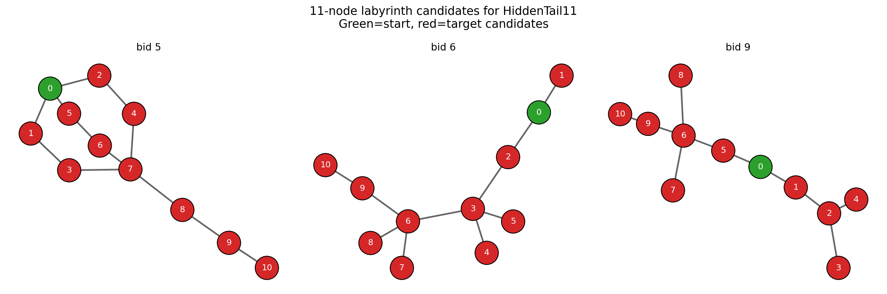

# Labyrinth Benchmark Mapping

This directory contains the serialized deterministic labyrinth benchmarks used by `benchmarks/sdec_labyrinth.py`.

The current paper-to-local-id mapping for the six IJCAI deterministic labyrinths is:

| Paper name | Local `bid` | Source file |
|---|---:|---|
| `ExtCross9` | `1` | `labyrinth_1.data` |
| `LopsidedY10` | `2` | `labyrinth_2.data` |
| `Ladder10` | `3` | `labyrinth_3.data` |
| `Maze12` | `4` | `labyrinth_4.data` |
| `HiddenTail11` | `5` | `labyrinth_5.data` |
| `Mesh10` | `7` | `labyrinth_7.data` |

These six match the Figure 2 topologies in `literature/_IJCAI_26__Approximate_Heuristic_Search_for_Semi_Decentralized_Systems.pdf`.

## Visual reference

Full local reference montage:



`HiddenTail11` was the only ambiguous 11-node case during evaluation. The side-by-side comparison below shows that `bid 5` is the visual match to the paper figure, while `bid 6` and `bid 9` are different 11-node topologies:



## Unmapped local graph ids

The local benchmark set also contains additional graph ids that are not part of the six deterministic IJCAI Figure 2 labyrinths:

| Local `bid` | Status |
|---:|---|
| `6` | extra 11-node local topology, not `HiddenTail11` |
| `8` | extra local topology, not used in the deterministic six-case IJCAI suite |
| `9` | extra 11-node local topology, not `HiddenTail11` |
| `10` | extra local topology, not used in the deterministic six-case IJCAI suite |

## Generated graph benchmarks

The larger `020` and `025` graph-scale `.data` files are generated artifacts
and are not versioned here. In particular, `chamber_3d_025` exceeds GitHub's
100 MB per-file limit. Keep those files as local artifacts or publish them
through an external archive/Git LFS if they are needed for a separate scaling
study.

## Stochastic Rescue/Assist Variant

The stochastic rescue-assist variant keeps the compact noisy Labyrinth state
encoding `s = u1*(N*T) + u2*T + t_idx` with no found flags, and keeps the same
position-plus-Beep/Silence observation process.  It replaces the terminal
`DRILL` commitment with `RESCUE` and adds a separate `ASSIST` action:

```text
WAIT, MOVE_1, ..., MOVE_k, RESCUE, ASSIST
```

Rewards are:

```text
+100  RESCUE at target with a valid ASSIST at/adjacent to the target
+80   RESCUE at target without a valid assist
-200  any RESCUE attempted at a wrong node
-1    otherwise
```

Generate/cache a rescue-assist stochastic benchmark with:

```powershell
python benchmarks\labyrinth_cache.py precompute_rescue_assist 1 0.90
```

This writes generated `.data` files under `benchmarks/labyrinth_benchmarks/rescue_assist/`
and cache files under `benchmarks/labyrinth_cache/`. The default reward tuple
is encoded explicitly, e.g. `_ra100_ru80_rwm200_rsm1`.

## Notes

- The deterministic IJCAI exact suite was run with the mapping above in `POMDPPlanners-master/run_ijcai_labyrinth_exact_suite.py`.
- The exact baseline results live in `logs/ijcai_labyrinth_exact_suite_3k_v2/`.
- `HiddenTail11 h=6` matches the paper very closely under this mapping. The larger `h=4/5` discrepancy appears to be an evaluation-behavior issue, not a topology-identity issue.
